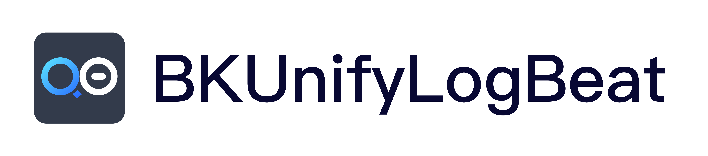

---

[English](README_EN.md) | 简体中文

> **Note**: The `master` branch may be in an *unstable or even broken state* during development.
Please use [releases](https://github.com/TencentBlueKing/BKUnifyLogBeat/releases) instead of the `master` branch in order to get stable binaries.

蓝鲸日志采集器基于[GSE采集框架](https://github.com/TencentBlueKing/collector-go-sdk) & [Beats](https://github.com/TencentBlueKing/beats) 进行开发，并为日志平台、计算平台、BCS等平台提供日志采集服务。 

## Overview
* [架构设计](docs/overview/architecture.md)
* [代码目录](docs/overview/code_framework.md)

## Features
 - 支持采集任务子配置及reload
 - 支持libbeat acker机制，并通过BoltDB存储采集进度
 - 适配内部其它采集器处理及格式化输出
 - 采集事件批量发送
 - 优化采集器指标上报机制
 - 优化日志采集配置

## Support
- [User Guide(in Prepare)](https://bk.tencent.com/docs)
- [BK forum](https://bk.tencent.com/s-mart/community)

## BlueKing Community

- [BK-CMDB](https://github.com/Tencent/bk-cmdb)：蓝鲸配置平台（蓝鲸 CMDB）是一个面向资产及应用的企业级配置管理平台。
- [BK-CI](https://github.com/Tencent/bk-ci)：蓝鲸持续集成平台是一个开源的持续集成和持续交付系统，可以轻松将你的研发流程呈现到你面前。
- [BK-BCS](https://github.com/Tencent/bk-bcs)：蓝鲸容器管理平台是以容器技术为基础，为微服务业务提供编排管理的基础服务平台。
- [BK-BCS-SaaS](https://github.com/Tencent/bk-bcs-saas)：蓝鲸容器管理平台 SaaS 基于原生 Kubernetes 和 Mesos 自研的两种模式，提供给用户高度可扩展、灵活易用的容器产品服务。
- [BK-PaaS](https://github.com/Tencent/bk-PaaS)：蓝鲸 PaaS 平台是一个开放式的开发平台，让开发者可以方便快捷地创建、开发、部署和管理 SaaS 应用。
- [BK-SOPS](https://github.com/Tencent/bk-sops)：标准运维（SOPS）是通过可视化的图形界面进行任务流程编排和执行的系统，是蓝鲸体系中一款轻量级的调度编排类 SaaS 产品。
- [BK-LOG](https://github.com/TencentBlueKing/bk-log)：日志平台（BK-LOG)是基于蓝鲸体系的分布式日志管理平台。

## Contributing

如果你有好的意见或建议，欢迎给我们提 Issues 或 Pull Requests，为蓝鲸开源社区贡献力量。关于 bk-log 分支管理、Issue 以及 PR 规范，
请阅读 [Contributing Guide](CONTRIBUTING.md)。

[腾讯开源激励计划](https://opensource.tencent.com/contribution) 鼓励开发者的参与和贡献，期待你的加入。

## License

项目基于 MIT 协议， 详细请参考 [LICENSE](LICENSE.txt) 。