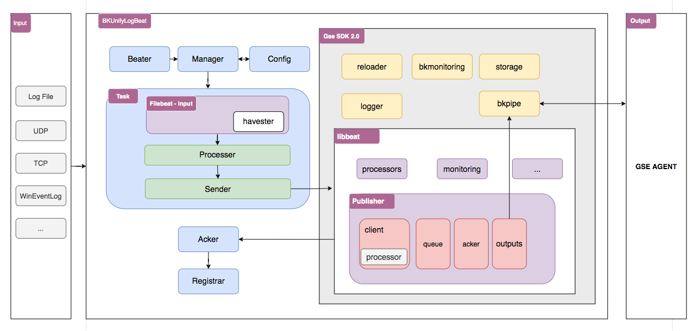

# 蓝鲸日志采集器（BKUnifyLogBeat）系统架构

蓝鲸日志采集器基于GSE采集框架2.0 & Filebeat进行开发，总体上可分成以下三个部分：
1. 任务调度: 通过监听reload事件，动态管理采集任务，并启动Filebeat Harvester进行采集
2. 事件处理: 对采集事件进行预处理、打包后发送给libbeat
3. Acker处理: 接收Libbeat Acker事件，并定期同步采集进度

